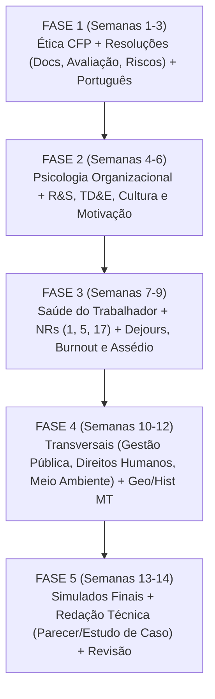

---
tags:
  - fluxo
  - estrategia
  - planejamento
---
# 📋 Fluxo de Estudo — Psicologia SEMA/MT 2026

## 🗺️ Diagrama de Fluxo Estratégico



---

## 🎯 Detalhamento das Fases

### FASE 1: Ética Profissional & Fundamentos da Avaliação (Semanas 1 a 3)
* **Objetivo:** Garantir pontuação máxima em legislação profissional do CFP e estruturar a base em Língua Portuguesa.
* **Disciplinas:**
  - [[08 - Ética Profissional e Resoluções do CFP]]: Código de Ética (Res. 10/2005), Documentos Escritos (Res. 06/2019), Avaliação Psicológica e SATEPSI (Res. 31/2022 e 08/2025), Riscos Psicossociais (Res. 14/2023).
  - [[03 - Língua Portuguesa]]: Crase, concordância, regência e pontuação com foco na Cesgranrio.
* **Carga:** 20h a 25h semanais.

### FASE 2: Psicologia Organizacional e Gestão de Pessoas (Semanas 4 a 6)
* **Objetivo:** Dominar os processos clássicos e modernos de Recursos Humanos e Comportamento Organizacional no setor público.
* **Disciplinas:**
  - [[09 - Psicologia Organizacional e Gestão de Pessoas]]: Gestão por Competências (CHA), Gestão de Desempenho (360º) e Gestão de Conflitos.
  - [[10 - Recrutamento, Seleção e TD&E]]: Técnicas de entrevista, levantamento de necessidades de treinamento (LNT), avaliação em níveis de Kirkpatrick.
  - [[11 - Cultura, Clima e Motivação no Trabalho]]: Níveis de cultura de Edgar Schein, teorias de Maslow, Herzberg e Vroom.
  - [[12 - Psicologia Social, Grupos e Liderança]]: Estilos de liderança e processos grupais.
* **Carga:** 25h semanais + 1º treino de discursiva.

### FASE 3: Saúde Mental no Trabalho & Clínicas do Trabalho (Semanas 7 a 9)
* **Objetivo:** Aprofundar no eixo temático de maior relevância prática para servidores estaduais e atuação junto ao SESMT/CIPA.
* **Disciplinas:**
  - [[14 - Saúde do Trabalhador e Normas Regulamentadoras]]: NR-1 (PGR e riscos psicossociais), NR-5 (CIPA e assédio), NR-17 (Ergonomia).
  - [[15 - Psicopatologia e Clínicas do Trabalho]]: Psicodinâmica do Trabalho (Christophe Dejours), Teoria do Estresse, Burnout e Portaria GM/MS 1.999/2023.
  - [[16 - Assédio, Discriminação e Violência no Trabalho]]: Assédio moral e sexual no ambiente público.
  - [[17 - Qualidade de Vida e Bem-Estar no Trabalho (QVT)]]: Modelos de QVT.
  - [[13 - Intervenção em Crises, Emergências e Catástrofes]]: Apoio psicossocial em desastres.
* **Carga:** 25h semanais + 2º treino de discursiva.

### FASE 4: Conteúdos Transversais e Regionais de MT (Semanas 10 a 12)
* **Objetivo:** Conquistar os pontos de Gestão Pública, Meio Ambiente e História/Geografia de MT para blindar a prova contra eliminação.
* **Disciplinas:**
  - [[06 - Conteúdos Transversais - Gestão Pública e Direitos Humanos]]: Ciclo de políticas públicas, povos indígenas e comunidades quilombolas.
  - [[07 - Conteúdos Transversais - Meio Ambiente e Clima]]: PNMA (Lei 6.938), Código Florestal, Mudanças Climáticas, CAR/PRA.
  - [[04 - Geografia e História de MT]]: Geografia regional, biomas, Cuiabá colonial, Rusga e desmembramento.
  - [[05 - Ética, Filosofia, Atualidades e Legislação]]: Estatuto MT (LC 04/90), Código de Ética MT (LC 112/02).
* **Carga:** 25h semanais.

### FASE 5: Reta Final, Simulados e Prova Discursiva (Semanas 13 e 14)
* **Objetivo:** Treino de tempo de prova e consolidação da escrita técnica.
* **Atividades:**
  - 2 simulados completos de 5 horas cronometradas (70 questões + 1 discursiva técnica).
  - Revisão rápida das NRs, resoluções do CFP e leis estaduais.
  - Aperfeiçoamento de pareceres e relatórios psicológicos.

---

## ⚖️ Distribuição de Tempo por Peso

```
Conhecimentos Específicos (Transversais + Psicologia) (40 pts | 57%) ──████████████████ (55% do tempo)
Língua Portuguesa (15 pts | 21%)                                     ──██████ (18% do tempo)
Geografia e História de MT (10 pts | 14%)                            ──████ (15% do tempo)
Ética, Filosofia e Legislação MT (5 pts | 7%)                        ──██ (12% do tempo)
Prova Discursiva Técnica (10 pts separados)                          ── 1 redação a cada 7-10 dias
```
